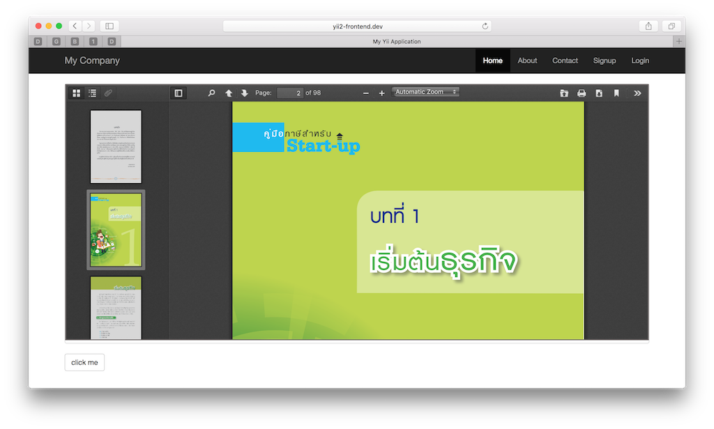
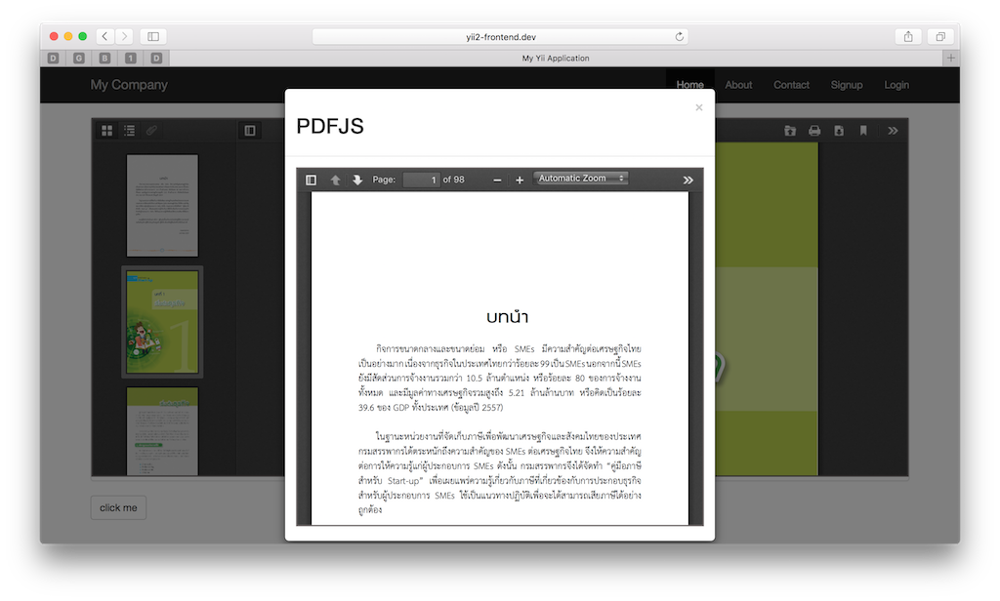
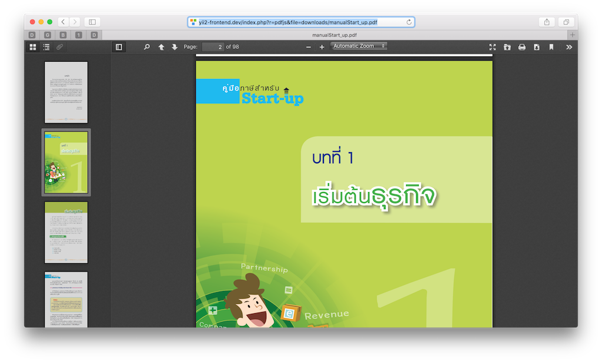
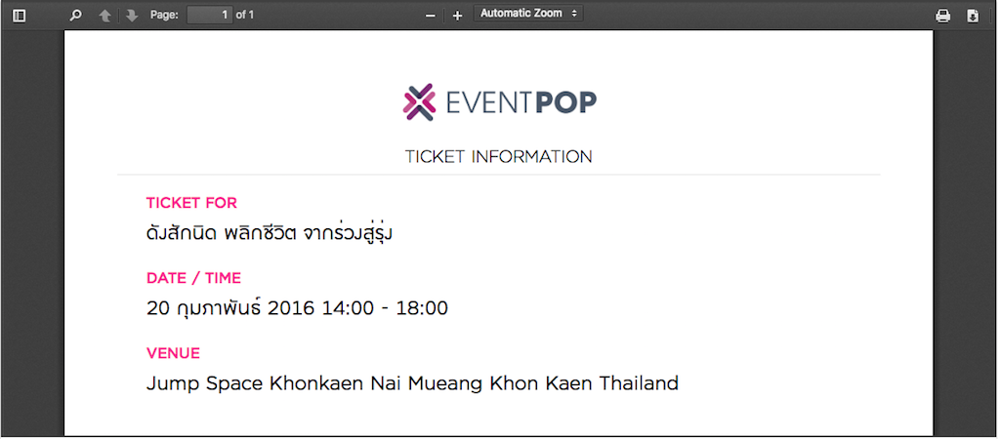
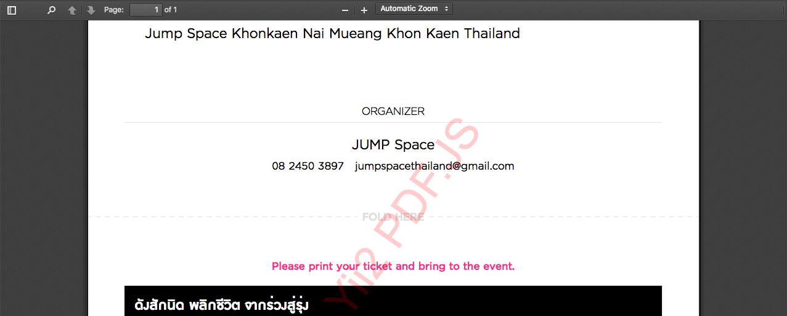

Yii2 PDFJS
==========
[](https://packagist.org/packages/yii2assets/yii2-pdfjs) [](https://packagist.org/packages/yii2assets/yii2-pdfjs) [](https://packagist.org/packages/yii2assets/yii2-pdfjs) [](https://packagist.org/packages/yii2assets/yii2-pdfjs) [](https://packagist.org/packages/yii2assets/yii2-pdfjs)

Yii2 PDFJS bundle of [PDF.js](https://mozilla.github.io/pdf.js/) plugin. PDF.js Portable Document Format (PDF) viewer.

Installation
------------

The preferred way to install this extension is through [composer](http://getcomposer.org/download/).

Either run

```
php composer require --prefer-dist yii2assets/yii2-pdfjs ">=1.0"
```

or add

```
"yii2assets/yii2-pdfjs": ">=1.0"
```

to the require section of your `composer.json` file.

Module Setup
-----
The extension has been created as a module to enable access preview `pdf` file. you must add the module to your configuration file.

```php
//....

'modules'=>[
  'pdfjs' => [
       'class' => '\yii2assets\pdfjs\Module',
   ],
],

//...
```


Usage
-----

Once the extension is installed, simply use it in your code by  :

```php
<?php
use yii\helpers\Url;
?>

<?= \yii2assets\pdfjs\PdfJs::widget([
  'url'=> Url::base().'/downloads/manualStart_up.pdf'
]); ?>
```


Using a `yii2-pdfjs` widget inside a modal dialog.
----

```php
<?php
use yii\bootstrap\Modal;
use yii\helpers\Url;

Modal::begin([
    'header' => '<h2>Hello world</h2>',
    'toggleButton' => ['label' => 'click me'],
]);

echo \yii2assets\pdfjs\PdfJs::widget([
  'url' => Url::base().'/downloads/manualStart_up.pdf'
]);

Modal::end();
?>
```


Using a `yii2-pdfjs` widget fullscreen viewer
-----

```
http://app-url/index.php?r=pdfjs&file=download/manualStart_up.pdf
```



Config Width & Height
-----
```php
<?php
use yii\helpers\Url;
?>

<?= \yii2assets\pdfjs\PdfJs::widget([
  'width'=>'100%',
  'heith'=> '500px',
  'url'=> Url::base().'/downloads/pdfjs.pdf'
]);
?>

```

Config disable toolbar buttons
-------------------------------

```php
<?php
use yii\helpers\Url;
?>

<?= \yii2assets\pdfjs\PdfJs::widget([
  'url'=> Url::base().'/downloads/pdfjs.pdf',
  'buttons'=>[
    'presentationMode' => false,
    'openFile' => false,
    'print' => true,
    'download' => true,
    'viewBookmark' => false,
    'secondaryToolbarToggle' => false
  ]
]);
?>
```



Add Watermark text
------------------
```php
//....

'modules'=>[
  'pdfjs' => [
       'class' => '\yii2assets\pdfjs\Module',
       'waterMark'=>[
         'text'=>' Yii2 PDF.JS',
         'color'=> 'red',
         'alpha'=>'0.3'
       ]
   ],
],

//...
```


